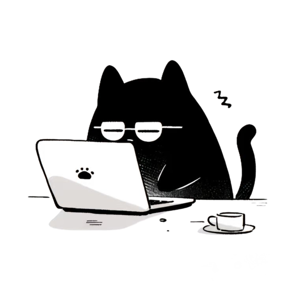

---

&nbsp;***Sobre mi***

Soy estudiante de Licenciatura en Tecnología Digital en la Universidad Torcuato Di Tella (UTDT), con interés en el desarrollo de software, la visualización de datos y la experiencia de usuario.

Me gusta construir soluciones que combinen programación, datos y diseño, siempre buscando aprender nuevas herramientas y mejorar la forma en que las personas interactúan con la tecnología.

En este GitHub comparto proyectos académicos y personales que reflejan mi recorrido y las tecnologías con las que trabajo.

Actualmente estoy en búsqueda de mi primera experiencia profesional, donde pueda seguir creciendo, aprender de nuevos desafíos y contribuir a un equipo. 

---

### 🛠️ Stack

### Other Tools and Technologies

---

### 📂 Proyectos
Los podrás encontrar en mis repositorios:

- **TP-FINAL_VISUA** — Visualización de datos tipo scrollytelling sobre el Holocausto "La historia que no debemos olvidar". Proyecto grupal. link: [HERE](https://francescadiiuorio.github.io/TP-FINAL_VISUA/)
-
